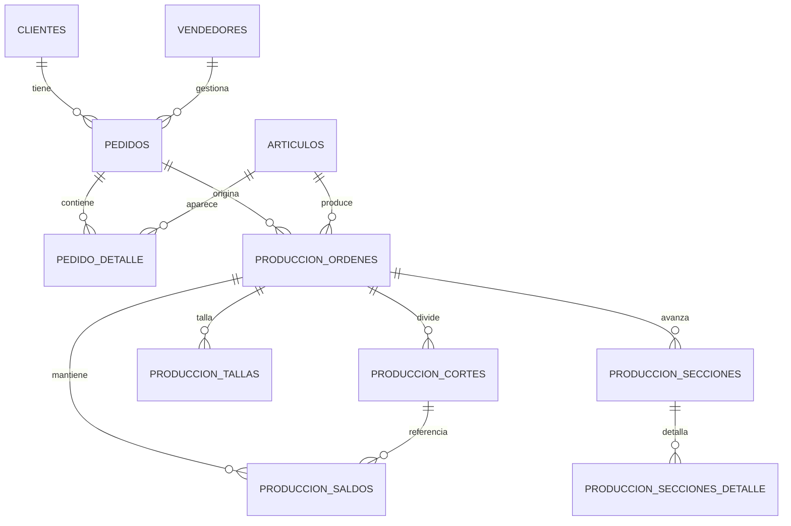

# Vista Visual: PostgreSQL Venta y Produccion

Esta vista baja el modelo a tablas visibles con datos de ejemplo.

Fuente usada para las muestras:

- [data/adecom.db](/c:/Users/Lenovo/Desktop/Backup/Data%20Manu/APIS/ADECOM%20WEB/data/adecom.db)

Notas:

- Las muestras de `produccion_cortes` y `produccion_saldos` salen directamente de tablas reales ya cargadas en SQLite.
- Las muestras de `articulos` y `pedido_detalle` son una proyeccion razonable desde la data actual disponible.
- Las tablas documentales finales de venta (`pedidos`, `ventas_documentos`, `ventas_detalle`) todavia requieren el extractor BBx real para quedar 100% fieles.

## Diagrama rapido

## 1. `adecom.articulos`

Asi se veria una tabla maestra minima de articulos a partir de lo que hoy ya se ve en `pedidos_talla` e `inventory_stock`.

| id | codigo | descripcion | familia | temporada | coleccion | tiro | bota | stock_actual |
| --- | --- | --- | --- | --- | --- | --- | --- | ---: |
| 1 | 01420200 | J MHC CINTURA R | 0142 | 42 | 42 | CINTURA | RECTO | 8 |
| 2 | 01421800 | J MHC CINTURA F | 0142 | 42 | 42 | CINTURA | FLARE | 0 |
| 3 | 01420100 | J MHC CINTURA P | 0142 | 42 | 42 | CINTURA | PITILLO | 341 |
| 4 | 01421400 | J MHC CINTURA O | 0142 | 42 | 42 | CINTURA | OXFORD | 74 |
| 5 | 430100 | MEDIO FLARE | 43 | 43 | 43 | MEDIO | FLARE | 473 |
| 6 | 432100 | CINTURA OXFORD | 43 | 43 | 43 | CINTURA | OXFORD | 454 |

## 2. `adecom.pedido_detalle`

Esta tabla es una vista de como deberia verse el detalle por talla una vez se lea `PEDDET` real. De momento la muestra se deriva de `pedidos_talla`.

Ejemplo base usando el articulo `01420200`:

| id | pedido_numero | articulo_codigo | descripcion | talla | cantidad_pedida | cantidad_despachada | cantidad_saldo | stock_actual |
| --- | --- | --- | --- | --- | ---: | ---: | ---: | ---: |
| 1 | PED-01420200-A | 01420200 | J MHC CINTURA R | 36 | 88 | 60 | 28 | 3 |
| 2 | PED-01420200-A | 01420200 | J MHC CINTURA R | 38 | 182 | 95 | 87 | 0 |
| 3 | PED-01420200-A | 01420200 | J MHC CINTURA R | 40 | 197 | 111 | 86 | 1 |
| 4 | PED-01420200-A | 01420200 | J MHC CINTURA R | 42 | 189 | 100 | 89 | -1 |
| 5 | PED-01420200-A | 01420200 | J MHC CINTURA R | 44 | 127 | 74 | 53 | 2 |
| 6 | PED-01420200-A | 01420200 | J MHC CINTURA R | 46 | 99 | 47 | 52 | 3 |

Referencia actual en la base:

| articulo | tipo | total | tallas_json |
| --- | --- | ---: | --- |
| 01420200 | ventas | 882 | [88, 182, 197, 189, 127, 99, 0, 0, 0] |
| 01420200 | despacho | 487 | [60, 95, 111, 100, 74, 47, 0, 0, 0] |
| 01420200 | saldo | 395 | [28, 87, 86, 89, 53, 52, 0, 0, 0] |
| 01420200 | stock | 8 | [3, 0, 1, -1, 2, 3, 0, 0, 0] |

## 3. `adecom.produccion_cortes`

Esta tabla si sale casi directa de `corte_etapas`.

| id | ocorte_numero | articulo_codigo | fecha_orden | programado | cortado | entrega | saldo | taller_fin | lavanderia_fin | terminacion_fin |
| --- | --- | --- | --- | ---: | ---: | ---: | ---: | --- | --- | --- |
| 1 | 00011566 | 01420200 | 2026-03-04 | 336 | 0 | 0 | 0 |  |  |  |
| 2 | 00011565 | 01422100 | 2026-03-04 | 342 | 0 | 0 | 0 |  |  |  |
| 3 | 00011564 | 01423300 | 2026-03-02 | 407 | 0 | 0 | 0 |  |  |  |
| 4 | 00011563 | 01423400 | 2026-02-27 | 627 | 0 | 0 | 0 |  |  |  |
| 5 | 00961256 | 01431100 | 2026-02-26 | 1 | 1 | 0 | 1 |  |  |  |
| 6 | 00961255 | 01431000 | 2026-02-26 | 1 | 1 | 0 | 1 |  |  |  |

## 4. `adecom.produccion_saldos`

Esta tabla sale de `saldos_seccion` y es clave para ver faltantes reales por articulo/corte.

| id | ocorte_numero | articulo_codigo | fecha_referencia | cantidad_saldo | proceso | bodega | taller | lavanderia | terminacion | taller_nombre |
| --- | --- | --- | --- | ---: | ---: | ---: | ---: | ---: | ---: | --- |
| 1 | 00011592 | 01431100 | 2026-04-20 | 606 | 606 | 0 | 0 | 606 | 0 | MANUFACTURAS TIERRA DEL FUEGO LTDA. |
| 2 | 00011602 | 01435300 | 2026-05-14 | 604 | 604 | 0 | 604 | 0 | 0 | MANUFACTURAS TIERRA DEL FUEGO LTDA. |
| 3 | 00011601 | 01432500 | 2026-05-11 | 600 | 600 | 0 | 0 | 0 | 0 | MANUFACTURAS TIERRA DEL FUEGO LTDA. |
| 4 | 00011599 | 01431900 | 2026-05-08 | 498 | 498 | 0 | 498 | 0 | 0 | MANUFACTURAS TIERRA DEL FUEGO LTDA. |
| 5 | 00011598 | 01436100 | 2026-05-08 | 498 | 498 | 0 | 0 | 0 | 498 | MANUFACTURAS TIERRA DEL FUEGO LTDA. |
| 6 | 00011604 | 01436600 | 2026-05-19 | 480 | 480 | 0 | 480 | 0 | 0 | MANUFACTURAS TIERRA DEL FUEGO LTDA. |

## 5. `adecom.produccion_tallas`

Asi se veria la tabla por talla cuando el extractor una `OCORTE` + `OPTALL`.

| id | ocorte_numero | articulo_codigo | talla | cantidad_programada | cantidad_cortada | cantidad_terminada |
| --- | --- | --- | --- | ---: | ---: | ---: |
| 1 | 00011566 | 01420200 | 36 | 14 | 0 | 0 |
| 2 | 00011566 | 01420200 | 38 | 98 | 0 | 0 |
| 3 | 00011566 | 01420200 | 40 | 73 | 0 | 0 |
| 4 | 00011566 | 01420200 | 42 | 100 | 0 | 0 |
| 5 | 00011566 | 01420200 | 44 | 65 | 0 | 0 |
| 6 | 00011566 | 01420200 | 46 | 60 | 0 | 0 |

## 6. `adecom.inventory_stock`

No estaba en el modelo minimo de venta/produccion, pero visualmente conviene verlo porque amarra pedido, saldo y sugerido.

| articulo | coleccion | tiro | bota | stock | 36 | 38 | 40 | 42 | 44 | 46 |
| --- | --- | --- | --- | ---: | ---: | ---: | ---: | ---: | ---: | ---: |
| 430100 | 43 | MEDIO | FLARE | 473 | 36 | 102 | 105 | 94 | 80 | 56 |
| 432100 | 43 | CINTURA | OXFORD | 454 | 38 | 94 | 107 | 83 | 75 | 57 |
| 431400 | 43 | CINTURA | RECTO | 453 | 44 | 94 | 108 | 84 | 70 | 53 |
| 432300 | 43 | CINTURA | WIDE LEG | 451 | 40 | 94 | 103 | 93 | 69 | 52 |
| 430900 | 43 | CINTURA | FLARE | 420 | 27 | 83 | 98 | 93 | 75 | 44 |

## 7. Lo que ya se puede poblar primero

Con la data que ya tienes, las primeras tablas PostgreSQL que se pueden llenar con confianza alta son:

- `adecom.articulos`
- `adecom.produccion_cortes`
- `adecom.produccion_saldos`
- `adecom.produccion_tallas`

Con extractor BBx adicional, se completa bien:

- `adecom.pedidos`
- `adecom.pedido_detalle`
- `adecom.ventas_documentos`
- `adecom.ventas_detalle`

## 8. Archivos relacionados

- Modelo base: [docs/POSTGRESQL_VENTA_PRODUCCION.md](/c:/Users/Lenovo/Desktop/Backup/Data%20Manu/APIS/ADECOM%20WEB/docs/POSTGRESQL_VENTA_PRODUCCION.md)
- DDL inicial: [sql/adecom_venta_produccion_schema.sql](/c:/Users/Lenovo/Desktop/Backup/Data%20Manu/APIS/ADECOM%20WEB/sql/adecom_venta_produccion_schema.sql)
